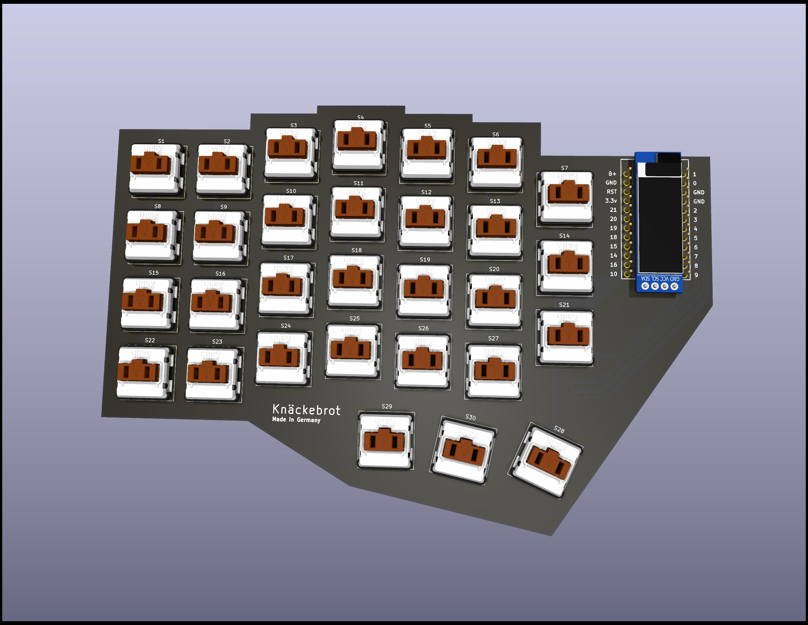

# Knäckebrot

A Corne inspired Split Keboard 

### Features

- Bluetooth
- Personalized Layout
- 128x32 Display

## List of all Parts 
 ```md
 
# For the Assembly

    - PCB
    - 240x Hot Plug Sockets
    - 120x Kahil Choc V2
    - 120x SOD-123
    - 1x Display 128x32
    - 2x Pro Micro NRF52840 | Nice!Nano V2
    - 2x Lipo Batteries (400 mAh)

## Firmware
    
    - Use our ZMK firmware which you can personalize via ZMK Studio
    - Load the Firmware on your controllers via Actions
## Assets
Case designs etc.. are in the Assets folder!

```



 